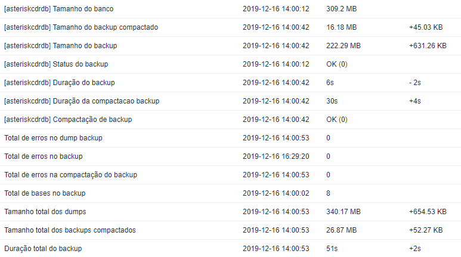
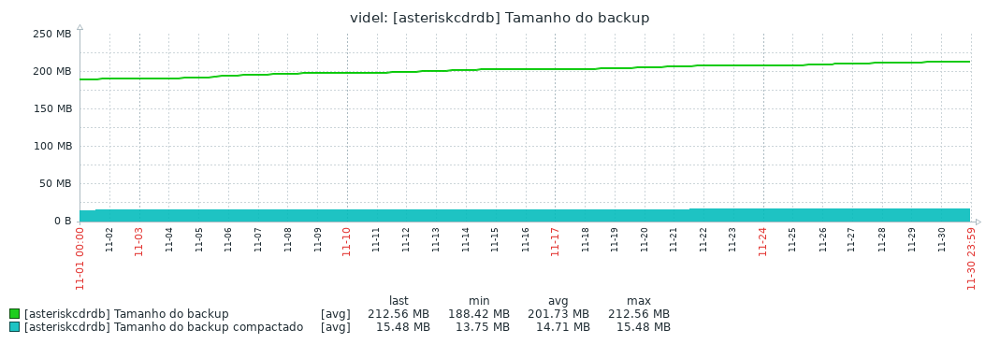

## Por que devo usar?
O backup monitor pode ser utilizado para monitoramento de cada passo realizado pelo script de backup, fornecendo métricas e indicadores para acompanhamento de seu backup. Todos os valores são enviados via ```zabbix-sender```. Então, certifique-se de que ele está instalado.

## Motivação
O Backup monitor surgiu de uma vontade de ajudar o DBA de nossa empresa. Todo o processo do backup do banco de dados é feito via shell-script (procedimento muito comum com bases MySQL e PostgreSQL) e enviados seus resultados enviados por e-mail. A partir do momento em que você tem mais de 10 servidores de banco de dados e algo em torno de 100 ou mais bases de dados, com backup 2 vezes ao dia, ler esses emails se torna um trabalho bastante chato e com grande facilidade de algo passar desapercebido. Colocando esses dados no Zabbix, o DBA poderá agora obversar todas as informações em telas que ele pode criar e tratar as falhas que o zabbix notificar via trigger.


#### Dados recentes


#### Gráfico do tamanho total do backup


#### Gráfico do tamanho do backup de uma base


# backup-monitor
## O template
O template [backup monitor](https://github.com/rauhmaru/zabbix-docs/blob/master/backup-monitor/zbx_template_backup_monitor.xml)  é composto por:
* 7 itens, 6 do tipo Zabbix trapper e um calculado.
  * Duração total do backup
  * Tamanho total dos backups compactados
  * Tamanho total dos dumps
  * Total de bases no backup
  * Total de erros na compactação do backup
  * Total de erros no backup
  * Total de erros no dump backup

* 3 gráficos:
  * Duração dos backups
  * Tamanho total dos backups
  * Total de erros nos backups

1 regra de descoberta, que por sua vez, cria para cada base de dados:
* 7 itens do tipo zabbix trapper
  * [{#BASE}] Compactação de backup
  *	[{#BASE}] Duração da compactacao backup
  * [{#BASE}] Duração do backup
  * [{#BASE}] Status do backup
  * [{#BASE}] Tamanho do backup
  * [{#BASE}] Tamanho do backup compactado
  * [{#BASE}] Tamanho do banco
  
* 2 triggers
  * Falha na compactação da base {#BASE}
  * Falha no dump da base {#BASE}
  
* 2 gráficos
  *	[{#BASE}] Duração do backup
  * [{#BASE}] Tamanho do backup

# O script de coleta de informações
Todas esses itens do template são alimentados pelos parâmetros abaixo descritos, que irá dentro do seu script de backup. 

## Funções existentes no script

Chave | Descrição
---- | -----
backup.status | Status do ultimo backup 
backup.status.zip | Status da compactação do ultimo backup
backup.duracao | Duracao do ultimo backup
backup.duracao.zip | Duracao da compactação do ultimo backup
backup.tamanho | Tamanho do ultimo backup
backup.tamanho.zip | Tamanho do ultimo backup compactado
backup.tamanho.total | Tamanho total do ultimo backup (todos os backups)
backup.erros.dump | Total de erros na execução do backup
backup.erros.compactacao | Total de erros na compactação do backup
duracao.execucao | Duração total do backup
tamanhodumps.total | Soma de todos os dumps sem compactação


## Explicando o funcionamento
O script nesse repositório pode ser utilizado tranquilamente por você, porém caso queira apenas implementar no seu próprio script, você deverá ter atenção como funciona cada chave para não obter resultados vazio ou incorretos.


### A função zabbix
Todas as informações coletadas são enviadas via `zabbix-sender`. O comando em si tem sua sintaxe e, para simplificar a sua utilização no script, foi criada uma função.

*Observação: Você deve alterar as variáveis de acordo com as suas necessidades. Se atente as variáveis ZabbixConfigFile e ZabbixServer*

```shell
function zabbix {
  # Arquivo de configuracao do Zabbix Agent
  ZabbixConfigFile="/etc/zabbix/zabbix_agentd.conf"
  # Nome do host exatamente como cadastrado no Zabbix Server
  ZabbixHostName="$HOST"
  # Endereco do Zabbix
  ZabbixServer="192.168.1.1"

  zabbix_sender -c ${ZabbixConfigFile} -s "${ZabbixHostName}" -k backup.${1}${3} -o "${2}" -z ${ZabbixServer}
}
```

### backup.total.bases
Esse item mostra quantas bases terão seus dados coletados. Por dentro do script de backup, ela executa o script [mysql-lista-bases.sh](https://github.com/rauhmaru/zabbix-docs/blob/master/backup-monitor/mysql-lista-bases.sh) e conta quantas ocorrências da string BASE são exibidas. Esse item é alimentado logo no começo da execução do script:
```shell
QtdeBases=$( /scripts/mysql_lista_bases.sh | grep -c BASE )
zabbix total.bases ${QtdeBases}
```

### backup.status
Status do ultimo backup. Após a execução do dump de cada base, é realizado um teste (```Status=$( echo $? ) ```) para ver se ocorreu um erro ou foi realizado com sucesso:

 ```shell
 mysqldump -h$SERVIDOR -u$USER -p$PASSWORD $banco --extended-insert --quick --routines --events --triggers >> $banco-$DATA.dmp
 Status=$( echo $?)
  ```
  E um pouco mais abaixo do script...

```shell
           if [ $Status != 0 ]; then
              echo "$ - Ocorreu algum erro durante o dump !!!" >>${LOG}
              let ErrosDump++
              zabbix status 1 [$banco]

           else
              echo " - Arquivo Integro !" >>${LOG}
              zabbix status 0 [$banco]

             fi
```
 
  Após o teste, o valor é enviado para o Zabbix. 0 significa que o dump ocorreu com sucesso e 1 que houve erro.
  
  
### backup.status.zip
Status da compactacao do ultimo backup. Após o dump, é realizada a compactação do dump, para redução do seu tamanho. Essa compactação também é verificada se ocorreu com sucesso (O arquivo existe, retorna 0). ou houve problema (o arquivo não foi criado, retorna 1).
 
 ```shell
       echo " - DUMP COMPACTADO " >> $LOG
       if [ ! -e  $BACKUP/$banco-$DATA.dmp.gz ]; then
              echo "$DATA - $banco -> Problemas com dump" >> $LOG
              let ErrosCompactacao++
              zabbix status.zip 1 [$banco]
       else
              zabbix status.zip 0 [$banco]
       fi
```


### backup.duracao
Duração do último backup. Cada backup tem seu tempo de execução medido. São disparados dois comandos ```date```, um no início e outro no final do dump. Após a execução do dump, é realizado um cálculo, onde obtemos o valor em segundos da duração do backup.

```shell
for banco in $databases; do
    InicioBackup=$( date +%s )
```
Após o comando do dump...
```shell
           TerminoBackup=$( date +%s )
           DuracaoBackup=$((TerminoBackup-InicioBackup))
```
E após o cálculo, o envio das informações ao server:
```shell
    zabbix duracao ${DuracaoBackup} [$banco]
```


### backup.duracao.zip
Duração da compactação do último backup. Semelhante ao item backup.duracao, porém medindo a compactação:
```shell
            InicioCompactacaoBackup=$( date +%s )
            gzip -9 $banco-$DATA.dmp
            TerminoCompactacaoBackup=$( date +%s )
            DuracaoCompactacaoBackup=$((TerminoCompactacaoBackup-InicioCompactacaoBackup))
```
E com o valor setado na variável **DuracaoCompactacaoBackup**, podemos enviar para o server:
```shell
zabbix duracao.zip ${DuracaoCompactacaoBackup} [$banco]
```


### backup.tamanho
Tamanho do ultimo backup. Após as execuções dos dumps, também é medido o seu tamanho.
```shell
           TamanhoBackup=$( wc -c ${banco}-$DATA.dmp )
           zabbix tamanho ${TamanhoBackup} [$banco]           
```


### backup.tamanho.zip
Tamanho do ultimo backup compactado. Semelhante ao backup.tamanho, porém usando a referência do arquivo compactado.
```shell
           TamanhoBackupZip=$( wc -c < ${banco}-$DATA.dmp.gz )
           zabbix tamanho.zip ${TamanhoBackupZip} [$banco]
```


### backup.tamanho.total
Tamanho total dos últimos backups (todos os backups). Após a execução do backup e compactação de todas as bases, o tamanho total dos arquivos compactados é obtido e enviado ao zabbix server:
```shell
TamanhoTotalBackup=$( du -bsc *-${DATA}.dmp.gz | awk /total/'{ print $1}' )
zabbix tamanho.total ${TamanhoTotalBackup}
```


### backup.erros.dump
Total de erros na execução do backup. Se caso ocorra uma falha no dump da base de dados, ela será contabilizada e enviada para o zabbix server, para que no final seja possível de modo simples, saber quantos erros ocorreram durante aquela execução. Os erros são contabilizados pela variável ```ErrosDump```.
```shell
           if [ $Status != 0 ]; then
              echo "$ - Ocorreu algum erro durante o dump !!!" >>${LOG}
              let ErrosDump++
              zabbix status 1 [$banco]

```

### backup.erros.compactacao
Total de erros na compactação do backup. Semenhante ao backup.erros.dump, porém contabiliza os erros da compactação. Os erros são contabilizados pela variável ```ErrosCompactacao```.
```shell
       if [ ! -e  $BACKUP/$banco-$DATA.dmp.gz ]; then
              echo "$DATA - $banco -> Problemas com dump" >> $LOG
              let ErrosCompactacao++
              zabbix status.zip 1 [$banco]
```


### duracao.execucao
Duração total do backup. O tempo de execução do backup completo é monitorado, além do tempo de cada base individualmente. Logo no início do script, é declarada a variável ```InicioExecucao```, que será utilizada em um cálculo no final do script
```shell
# Inicio do backup
InicioExecucao=$( date +%s )
```
Após a execução de todos dumps e compactações, defina a variável ```TerminoExecucao```, realize o cálculo, e envie para o server:
```shell
TerminoExecucao=$( date +%s )
DuracaoExecucao=$((TerminoExecucao-InicioExecucao))
zabbix duracao.execucao ${DuracaoExecucao}
```


### tamanhodumps.total
Soma de todos os dumps sem compactação. Após cada dump realizado, seu tamanho é coletado pela variável ```TamanhoBackup```, e depois somado a variável ```TamanhoTotalBackups```:

Coleta do tamanho após o dump:
```shell
           mysqldump -h$SERVIDOR -u$USER -p$PASSWORD $banco --extended-insert --quick --routines --events --triggers >> $banco-$DATA.dmp
           Status=$( echo $?)
           echo "Status do backup de $banco foi $?" >> backup_status.txt
           TerminoBackup=$( date +%s )
           DuracaoBackup=$((TerminoBackup-InicioBackup))
           TamanhoBackup=$( wc -c < ${banco}-$DATA.dmp )
```
Antes do fim do `for`, o valor dessa variável é somada a variável `TamanhoTotalBackups`
```shell
    TamanhoTotalDumpsBackup=$((TamanhoTotalDumpsBackup+TamanhoBackup))

done
```
E já fora do laço, o valor do tamanho de todos os dumps é enviado para o server:
```shell
zabbix tamanhodumps.total $TamanhoTotalDumpsBackup
```

### database.size
Tamanho da base dentro do banco. Esse item atualmente funciona apenas para o MySQL, porém nada impede de que você crie a sua versão para PostgreSQL, Oracle, MSSQL ou outro. Antes do `for` iniciar com os dumps das bases, é executado um `select` dentro da base do MySQL, retornando o tamanho de cada base, e jogando essa saída em um arquivo (variável `TmpFile`). Quando o laço se inicia, ele verifica qual a base está sendo feito o backup e coleta o seu tamanho no arquivo.
```shell
# Exibe o tamanho total do banco de dados
mysql -u $USER -hlocalhost -p$PASSWORD -e \
'SELECT table_schema AS "Database",\
 ROUND(SUM(data_length + index_length)) \
 AS "Size (B)" \
 FROM information_schema.TABLES \
 GROUP BY table_schema;' > $TmpFile
```
A saída é algo do tipo:
```shell
cat /tmp/mysqlDatabasesSize.txt
Database        Size (B)
asterisk        47697920
asteriskcdrdb   324222976
gserv   212992
information_schema      180224
lacuna21        4292608
mysql   1185526
ocsweb  197798540
performance_schema      0
qstats  24871089
wordpress       1916928
```


E já dentro do `for`, após o dump da base:
```shell
          TamanhoBanco=$(awk /$banco/'{ print $NF }' $TmpFile )
          zabbix database.size ${TamanhoBanco} [$banco]
```
